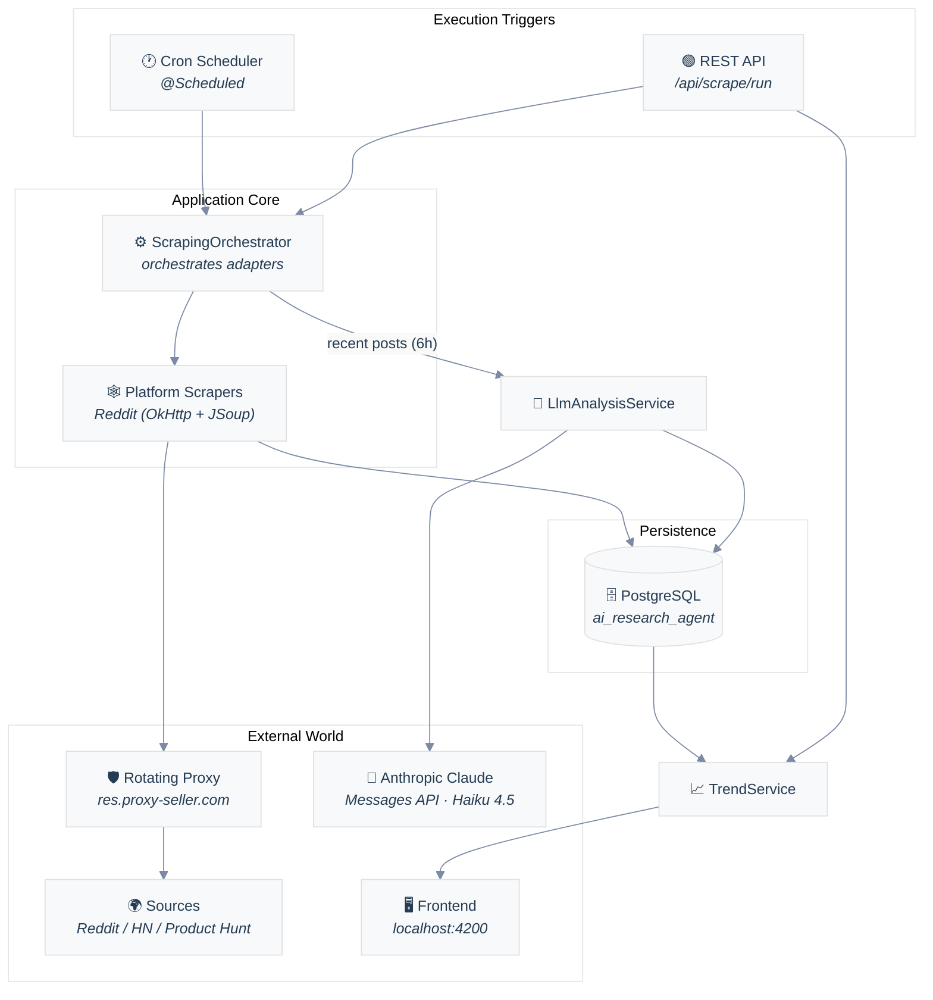
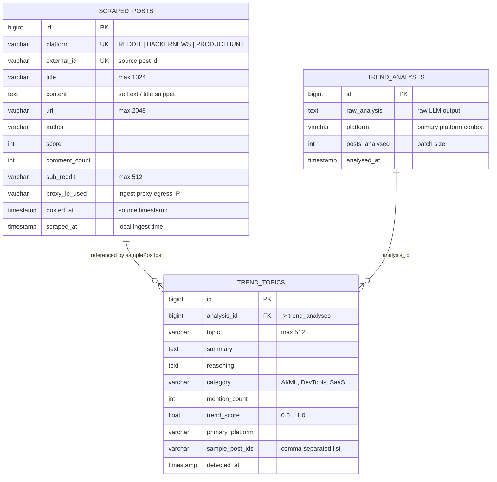

# 🧠 AI Research Agent

> Automated **trend-intelligence** engine that scrapes technology communities, mines them with an LLM, and surfaces the emerging topics worth watching — served through a REST API.

The **AI Research Agent** is a Java 17 / Spring Boot service that continuously monitors developer and startup communities (Reddit, Hacker News, Product Hunt), stores every post it discovers, and uses **Claude (Anthropic)** to distil the raw noise into a ranked list of trending topics — complete with summaries, reasoning, category, and a confidence score.

It is designed as the *research backbone* for a product that answers the question: **"What is the tech world excited about right now?"**

---

## Table of Contents

- [Motivation](#motivation)
- [Key Features](#key-features)
- [Architecture Overview](#architecture-overview)
- [Technology Stack](#technology-stack)
- [Project Structure](#project-structure)
- [Research Cycle (Data Flow)](#research-cycle--data-flow-)
- [Data Model](#data-model)
- [REST API](#rest-api)
- [Configuration](#configuration)
- [Getting Started](#getting-started)
- [Current Status & Roadmap](#current-status--roadmap)

---

## Motivation

Hobbyist-friendly trend research is dominated by manual browsing. This project replaces that workflow with an **automated scraping + LLM analysis pipeline**:

1. Pull fresh content from multiple tech communities.
2. Aggregate the highest-signal posts.
3. Ask a large language model to identify **emerging** (not yet mainstream) topics.
4. Persist the results and expose them over HTTP so a dashboard or frontend can consume them.

The `Platform` enum already models Reddit, Hacker News, and Product Hunt, and the configuration defines targets for all three — though the scraping adapters are currently implemented for **Reddit only** (see [Roadmap](#current-status--roadmap)).
---

## Key Features

| Feature | Description |
|---|---|
| 🌐 **Multi-platform scraping** | Plug-in architecture (`PlatformScraper` interface) so new communities can be added without touching core logic. Reddit adapter included. |
| 🛡️ **Proxy rotation** | All outbound HTTP is tunnelled through a proxy (`OkHttp` + `ProxyConfig`) to avoid IP-based rate-limiting and blocks. Records the ingest proxy IP per post. |
| 🧠 **LLM-driven analysis** | Batches recent posts to **Anthropic Claude (Haiku 4.5)** with a strict JSON contract to extract trends, categories, and relevance scores. Includes 3-attempt retry with backoff. |
| 🗃️ **Relational persistence** | JPA entities (`ScrapedPost`, `TrendAnalysis`, `TrendTopic`) stored in **PostgreSQL**, with a unique `(platform, externalId)` constraint for idempotent ingestion. |
| ⏰ **Scheduled research cycles** | Spring `@Scheduled` cron job runs the full scrape-and-analyse cycle automatically (configurable interval). |
| 🔌 **REST API** | Read endpoints for posts and trends plus a manual cycle trigger — CORS-enabled for a frontend on `http://localhost:4200`. |
| ✔️ **Idempotent ingestion** | Already-seen posts are skipped, so reruns never duplicate persisted rows. |

---

## Architecture Overview

The application follows a **classic layered architecture** (Controller → Service → Repository) with two purpose-built extensions:

- **A scraper layer** that isolates HTTP/proxy concerns behind a `PlatformScraper` interface.
- **An AI analysis pipeline** that keeps the LLM interaction self-contained behind `LlmAnalysisService`.


---

## Technology Stack

| Area | Technology | Version | Notes |
|---|---|---|---|
| **Language** | Java | 17 | — |
| **Framework** | Spring Boot | 4.0.8 | Starter parent; Web, Data JPA, WebFlux starters |
| **AI / LLM** | Spring AI | 2.0.1 | `spring-ai-jsoup-document-reader` (+ `spring-ai-bom`) |
| **Model provider** | Anthropic Claude | — | `claude-haiku-4-5-20251001` via Messages API |
| **HTTP client** | OkHttp | 4.12.0 | Proxy-aware scraping client (`okhttp`'s `Proxy` + proxy auth) |
| **HTML parsing** | JSoup | 1.18.3 | DOM extraction for scraped pages |
| **Reactive web** | Spring WebFlux | (Spring Boot) | `WebClient` used for the Anthropic call |
| **Database** | PostgreSQL | — | Driver `org.postgresql:postgresql` (runtime) |
| **ORM** | Spring Data JPA / Hibernate | — | `ddl-auto: update`, entities auto-mapped |
| **Boilerplate** | Lombok | 1.18.36 | `@Getter/@Setter/@Builder/@Slf4j/@RequiredArgsConstructor` |
| **Build** | Maven | — | Wrapper (`./mvnw`) |
| **Tests** | JUnit 5 / Spring Boot Test | — | Smoke context-load test |

> **Key libraries at a glance** — the scraping path uses **OkHttp** (with an authenticated rotating proxy and a realistic User-Agent), the analysis path uses **WebClient** (WebFlux) to call Anthropic, and everything is glued together by **Spring Boot** + **Lombok**.

---

## Project Structure

```
ai-research-agent/
├── pom.xml                      # Maven config, dependencies, Spring Boot 4.0.8
├── .env.example                 # DB_USERNAME / DB_PASSWORD template
├── src/
│   ├── main/
│   │   ├── resources/
│   │   │   └── application.yml  # datasource, proxy, anthropic & scraping settings
│   │   └── java/com/pgs/ai/research/agent/
│   │       ├── AgentApplication.java      # @SpringBootApplication entry point
│   │       ├── config/
│   │       │   ├── AnthropicConfig.java   # WebClient bean → Anthropic Messages API
│   │       │   ├── ProxyConfig.java       # @ConfigurationProperties(prefix="proxy")
│   │       │   └── WebConfig.java         # CORS for http://localhost:4200
│   │       ├── controller/
│   │       │   ├── ScrapeController.java  # /api/scrape/*  (run, platform, posts)
│   │       │   └── TrendController.java   # /api/trends/* (top, latest, category…)
│   │       ├── model/
│   │       │   ├── Platform.java          # enum: REDDIT, HACKERNEWS, PRODUCTHUNT
│   │       │   ├── ScrapedPost.java       # @Entity scraped_posts
│   │       │   ├── TrendAnalysis.java     # @Entity (raw LLM output)
│   │       │   └── TrendTopic.java        # @Entity (a detected trend)
│   │       ├── repository/
│   │       │   ├── ScrapedPostRepository.java
│   │       │   ├── TrendAnalysisRepository.java
│   │       │   └── TrendTopicRepository.java
│   │       ├── scheduler/
│   │       │   └── ResearchScheduler.java # @Scheduled cron research cycle
│   │       ├── scraper/
│   │       │   ├── AbstractScraper.java   # OkHttp + proxy fetch/detection
│   │       │   ├── PlatformScraper.java   # interface: getPlatform() + scrape()
│   │       │   └── RedditScraper.java     # Reddit .json "hot" adapter
│   │       └── service/
│   │           ├── ScrapingOrchestrator.java  # runs all PlatformScrapers, persists
│   │           ├── LlmAnalysisService.java    # LLM prompt + response parsing
│   │           └── TrendService.java          # trend read queries + dashboard stats
│   └── test/java/com/pgs/ai/research/agent/
│       └── AgentApplicationTests.java      # Spring context smoke test
└── target/                       # build output (git-ignored)
```
---

## Research Cycle (Data Flow)

The heart of the system is the **research cycle**: either triggered on a cron schedule or manually via the REST API. It scrapes, persists, and then asks the LLM to summarise the batch into trends.

```mermaid
%%{init: {"theme": "base", "sequence": {"mirrorActors": false}}}%%
sequenceDiagram
    autonumber
    participant S as Scheduler<br/><i>@Scheduled / API</i>
    participant O as ScrapingOrchestrator
    participant R as RedditScraper<br/><i>(OkHttp + proxy)</i>
    participant P as Rotating Proxy
    participant EX as Reddit .json<br/>community feeds
    participant DB as PostgreSQL
    participant L as LlmAnalysisService<br/><i>(WebClient)</i>
    participant A as Anthropic Claude<br/><i>Haiku 4.5</i>

    S->>O: runResearchCycle() / scrapeAll()
    O->>R: scrape()
    R->>P: GET /r/{sub}/hot.json?limit=25
    P->>EX: relay request (rotated IP)
    EX-->>R: JSON feed
    R->>R: filter already-seen<br/>(existsByPlatformAndExternalId)
    R-->>O: List<ScrapedPost>
    O->>DB: saveAll(posts) &nbsp;<i>(unique platform+externalId)</i>

    O->>DB: findByScrapedAtAfter(6h)
    DB-->>O: recent posts
    O->>L: analyze(recentPosts)
    L->>A: POST /v1/messages<br/><i>system prompt + batch</i>
    A-->>L: JSON trends array
    L->>L: validate + parse topics
    L->>DB: save TrendAnalysis + TrendTopics

    O-->>S: results map {platform: count}
```

> If Anthropic is unreachable, the service retries up to **3 times** with a 2s backoff and still records a `TrendAnalysis` row (with the raw/empty response) so the cycle never hard-fails.

---

## Data Model

The persistence layer is defined by three JPA entities. `scraped_posts` stores raw ingested content, while `trend_analyses` and its related topics store the LLM-derived insights.



> **Note:** `ScrapedPost` keeps a **unique constraint on `(platform, externalId)`**, and `TrendTopic` maps to the table named `trend_analyses` in the current code — a modelling quirk where the entity sits alongside the parent analysis table. Worth aligning with a dedicated `trend_topics` table in a future refactor.
---

## REST API

All endpoints are exposed under `/api`, and **CORS** is pre-configured for a frontend running on `http://localhost:4200`.

### Scraping — `ScrapeController`

| Method | Path | Description | Response |
|---|---|---|---|
| `POST` | `/api/scrape/run` | **Full cycle**: scrape all platforms → save → analyze recent posts with the LLM. | `{ scrapeResults, postsAnalyzed, analysisId }` |
| `POST` | `/api/scrape/platform/{platform}` | Scrape and persist a single `Platform` (`REDDIT`, `HACKERNEWS`, `PRODUCTHUNT`). | `List<ScrapedPost>` |
| `GET` | `/api/scrape/posts` | Recent persisted posts (optionally filter by `?platform=` query param). | `List<ScrapedPost>` |

### Trends — `TrendController`

| Method | Path | Description | Response |
|---|---|---|---|
| `GET` | `/api/trends` | Top 20 trends by `trendScore`. | `List<TrendTopic>` |
| `GET` | `/api/trends/latest` | Trends detected in the last 24h, score-desc. | `List<TrendTopic>` |
| `GET` | `/api/trends/category/{category}` | Trends filtered by category (e.g. `AI/ML`, `DevTools`). | `List<TrendTopic>` |
| `GET` | `/api/trends/platform/{platform}` | Trends where the given platform is primary. | `List<TrendTopic>` |
| `GET` | `/api/trends/stats` | Dashboard counters: total/reddit/HN/PHP posts, total trends, last analysis time. | `Map<String, Object>` |

---

## Configuration

Everything is centralised in [`src/main/resources/application.yml`](src/main/resources/application.yml), with secrets injected from environment variables.

| Key | Meaning | Source |
|---|---|---|
| `spring.datasource.*` | PostgreSQL URL + `DB_USERNAME` / `DB_PASSWORD` | env |
| `proxy.*` | Rotating-provider host/port/credentials + realistic `User-Agent` | `PROXY_USERNAME` / `PROXY_PASSWORD` |
| `anthropic.api-key` | Anthropic credentials | `ANTHROPIC_API_KEY` |
| `anthropic.model` | LLM model (currently Haiku 4.5) | yaml |
| `scraping.cron` | Cron expression for the automatic research cycle (default every 3 days) | yaml |
| `scraping.reddit.*` | Target subreddits + posts-per-subreddit | yaml |
| `scraping.hackernews.*` | HN top stories count (config prepared) | yaml |
| `scraping.producthunt.*` | Product Hunt posts count (config prepared) | yaml |

Environment variables are loaded via `spring.config.import: optional:file:.env[.properties]` (see [`.env.example`](.env.example)).

---

## Getting Started

**1. Prerequisites**
- Java **17**+ and Maven (or the included `./mvnw` wrapper).
- PostgreSQL running on `localhost:5432` with an `ai_research_agent` database.

**2. Configure secrets**
```bash
cp .env.example .env
# then edit .env
DB_USERNAME=your_db_username
DB_PASSWORD=your_db_password
```
Optionally export `ANTHROPIC_API_KEY`, `PROXY_USERNAME`, and `PROXY_PASSWORD` if the corresponding integrations are enabled.

**3. Run**
```bash
./mvnw spring-boot:run
```
The app starts on the default port, applies the JPA schema (`ddl-auto: update`), and — depending on `scraping.cron` — begins running research cycles.

**4. Trigger a cycle manually**
```bash
curl -X POST http://localhost:8080/api/scrape/run
curl http://localhost:8080/api/trends/stats
```

**5. Test**
```bash
./mvnw test
```

---

## Current Status & Roadmap

**Implemented**
- ✅ Layered Spring Boot project bootstrapping on Spring Boot 4.0.8 / Java 17.
- ✅ Proxy-aware OkHttp scraping infrastructure (`AbstractScraper`) with IP detection.
- ✅ **Reddit** adapter (`RedditScraper`) + idempotent persistence.
- ✅ Anthropic Claude integration with retries and strict JSON parsing.
- ✅ Trend REST endpoints + dashboard statistics.
- ✅ Scheduled research cycles via cron.

**Planned / In progress**
- 🔜 Hacker News and Product Hunt scrapers (config and `Platform` enum already in place).
- 🔜 `TrendService` currently accepts a raw `String` platform — aligning it with the `Platform` enum would remove a minor type-safety gap.
- 🔜 Dedicated `trend_topics` table for the `TrendTopic` entity (it currently maps to `trend_analyses`).
- 🔜 Field-level validation/tests beyond the smoke test, e.g. for LLM response parsing.
- 🔜 Optional Docker Compose to spin up PostgreSQL locally.

---

*Generated as technical documentation for the `ai-research-agent` service. Stack: Spring Boot · Spring AI · PostgreSQL · OkHttp · Anthropic Claude.*